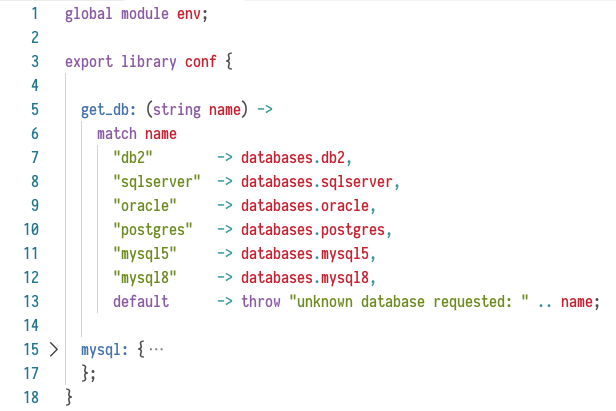
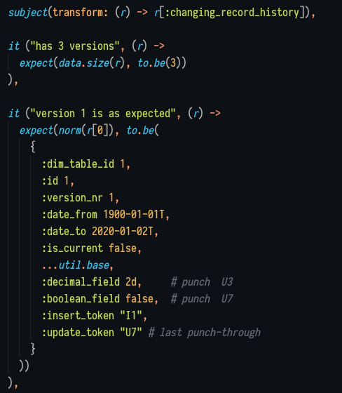

# Tweakflow Support for VS Code

This is an extension for VS Code to support the [Tweakflow](https://github.com/twineworks/tweakflow/) language.

## Release Notes

### 1.1.0

 - Update to allow `.` characters in key strings

### 1.0.0

 - Syntax highlighting

